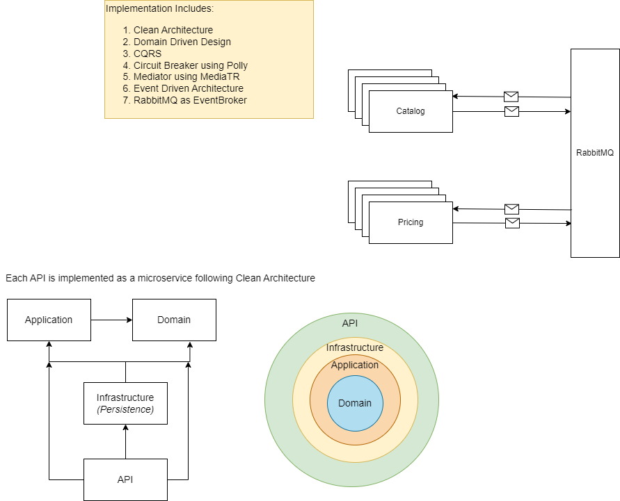

# Microservices - Sample implementation using RabbitMQ

## Architecture Overview


## Prerequisites 

* [.NET Core 3.1 SDK](https://dotnet.microsoft.com/download)

* [Visual Studio 2019](https://visualstudio.microsoft.com/vs/)

* SQL Express (Comes by default with Visual Studio)

## EF Migrations:

EF migrations are already checked in, so only data base update is enough.

```
In directory : Pricing.Infrastructure
dotnet ef database update --context IntegrationLogDbContext
dotnet ef database update --context ProductPriceDbContext

In directory : ProductCatalogue.Infrastructure
dotnet ef database update --context IntegrationLogDbContext
dotnet ef database update --context ProductsDbContext
```
After that you must be able to see below structure in ServerExplorer of Visual Studio


After this, Integration unit test cases can be run from 

#### Note:
Databases would be automatically seeded with test data while running integration test cases
